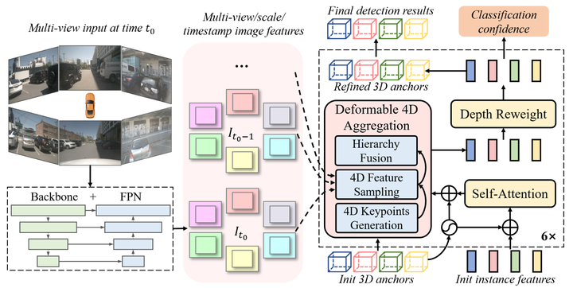

# SparseEnd2End: Obstacle 3D Detection and Tracking Architecture Based VisionTransformer

--------------------------------------------------------------------------------
| [**Blog**](https://zhuanlan.zhihu.com/p/715179777) |  

👋 Hi, I’m ThomasVonWu. I'd like to introduce you to a  simple and practical **deployment repository based on TensorRT** which uses end-to-end perception paradigm with sparse transformer to sense 3D obstacles. This repository has no complex dependency for Training | Inference | Deployment(which means, we don't need to install [MMDetection3d](https://github.com/open-mmlab/mmdetection3d), [mmcv](https://github.com/open-mmlab/mmcv), [mmcv-full](https://github.com/open-mmlab/mmcv), [mmdeploy](https://github.com/open-mmlab/mmdeploy), etc.), so it's easy to install in your local workstation or supercomputing gpu clusters. This repository will also provide x86(NVIDIA RTX  Series GPU) | ARM(NVIDIA ORIN) deployment solutions. Finally, you can deploy your e2e model onborad through this repository happily.  
👀 I guess you are interested in:  
- how to define a PyTorch custom operator: DeformableAttentionAggr and register related ONNX node.
- how to build a custom opertator plugin: DeformableAttentionAggr in TensorRT engine with Makefile or CMake.
- how to convert ONNX format file with custom opertator to TensorRT engine and make it as  part of the whole  engine.
- how to validate inference results consistency : PyTorch results vs. ONNX Runtime results vs. TensorRT results.
- how to convert PyTorch model with temporal fusion transformer head to ONNX.
- how to locate the TensorRT layer accurately when overflow occurs during using fp16 quantization for model parameter.

## Algorithm Architecture

    
     
    
Algorithm Framework of Sparse4D, which conforms to an encoder-decoder structure. The inputs mainly consists of three components: multi-view images, newly initialized instances, propagated instances from previous frame. The output is the refined instances (3D anchor boxes and corresponding features), serve as the perception results for the current frame. Additionally, a subset of these refined instances is selected and propagated to the next frame.

## nuScenes Benchmark
### Results on Validation Split: `ThomasVonWu/SparseEnd2End` v.s. `HorizonRobotics/Sparse4D`
These training reproduction experiments were conducted using 4 NVIDIA H20 GPUs with 96 GB memory.
|model | repository | backbone |pretrain| img size | Epoch | Traning | FPS | NDS | mAP |  AMOTA |AMOTP |IDS| config | ckpt | log | GPU |
|  :----:  | :---: | :---: | :---: | :---: | :---:| :---:|:---:|:---: | :---: | :----: | :----: | :---: | :----: | :----: | :----: |:----: |
|Sparse4Dv3|[HorizonRobotics/Sparse4D](https://github.com/HorizonRobotics/Sparse4D)|Resnet50|[ImageNet](https://download.pytorch.org/models/resnet50-19c8e357.pth)|256x704| 100 |22H | 19.8 |0.5637|0.4646|0.477|1.167|456| - | - | - | RTX3090 |
|Sparse4Dv3|[ThomasVonWu/SparseEnd2End](https://github.com/ThomasVonWu/SparseEnd2End)|Resnet50|[ImageNet](https://download.pytorch.org/models/resnet50-19c8e357.pth)|256x704| 150 |77.5H | - |0.5623|0.4645|0.457|1.196|541| [cfg](dataset/config/sparse4d_temporal_r50_1x4_bs22_256x704.py) | [ckpt](https://drive.google.com/file/d/1sSMNB7T7LPKSr8nD9S_tSiu1mJrFMZ1I/view?usp=sharing) | [log](https://drive.google.com/file/d/1_TkatIdrfGzaZvUT02y3d4ctl2HIQ5oG/view?usp=drive_link) | H20 |

## SparseEnd2End Deployment Experiments Results
|         **Model**        | **ImgSize** | **Backbone** | **Framework** | **Precision** | **mAP** | **NDS** | **FPS** |                  **GPU**                  | **config**| **ckpt**|**onnx**|**engine**|
|:----------------------------:|:-------------------:|:------------------------:|:------------------------:|:----------------------:|:--------------:|:-------------:|:-------------:|:----------------:|:----------------:|:----------------:|:----------------:|:----------------:|
|         Sparse4Dv3      |    256x704     |     Resnet50    |           PyTorch       |            FP32        |     0.4645     |     0.5623    |     15.8     |  RTX 3090 |[config](dataset/config/sparse4d_temporal_r50_1x1_bs1_256x704_mini.py)|[ckpt](https://drive.google.com/file/d/1sSMNB7T7LPKSr8nD9S_tSiu1mJrFMZ1I/view?usp=sharing)|     --     |     --     |
|         Sparse4Dv3      |    256x704     |     Resnet50    |          TensorRT     |            FP32        |      wait       |     wait      |     wait     |  RTX 3090 |[config](dataset/config/sparse4d_temporal_r50_1x1_bs1_256x704_mini.py)|[ckpt](https://drive.google.com/file/d/1sSMNB7T7LPKSr8nD9S_tSiu1mJrFMZ1I/view?usp=sharing)|[onnx](https://drive.google.com/drive/folders/1dbjnV5AW4-VB0zbYUsUAhGjo0lGm177m?usp=sharing)|[engine](https://drive.google.com/drive/folders/1ZIxTDVsG0QaW9FwSSnrS1JZUKF0_OymG?usp=sharing)|
|         Sparse4Dv3      |    256x704     |     Resnet50    |          TensorRT     |            FP16        |      wait       |     wait      |     wait     |  RTX 3090 |[config](dataset/config/sparse4d_temporal_r50_1x1_bs1_256x704_mini.py)|[ckpt](https://drive.google.com/file/d/1sSMNB7T7LPKSr8nD9S_tSiu1mJrFMZ1I/view?usp=sharing)|     wait     |     wait     |
|         Sparse4Dv3      |    256x704     |     Resnet50    |          TensorRT     |    INT8+FP16    |      wait       |     wait      |     wait     |  RTX 3090 |[config](dataset/config/sparse4d_temporal_r50_1x1_bs1_256x704_mini.py)|[ckpt](https://drive.google.com/file/d/1sSMNB7T7LPKSr8nD9S_tSiu1mJrFMZ1I/view?usp=sharing)|     wait     |     wait     |
|         Sparse4Dv3      |    256x704     |     Resnet50    |          TensorRT     |            FP32        |      wait       |     wait      |     wait     |      NVIDIA ORIN      |[config](dataset/config/sparse4d_temporal_r50_1x1_bs1_256x704_mini.py)|[ckpt](https://drive.google.com/file/d/1sSMNB7T7LPKSr8nD9S_tSiu1mJrFMZ1I/view?usp=sharing)|     wait     |     wait     |
|         Sparse4Dv3      |    256x704     |     Resnet50    |          TensorRT     |            FP16        |      wait       |     wait      |     wait     |      NVIDIA ORIN      |[config](dataset/config/sparse4d_temporal_r50_1x1_bs1_256x704_mini.py)|[ckpt](https://drive.google.com/file/d/1sSMNB7T7LPKSr8nD9S_tSiu1mJrFMZ1I/view?usp=sharing)|     wait     |     wait     |
|         Sparse4Dv3      |    256x704     |     Resnet50    |          TensorRT     |    INT8+FP16    |      wait       |     wait      |     wait     |      NVIDIA ORIN      |[config](dataset/config/sparse4d_temporal_r50_1x1_bs1_256x704_mini.py)|[ckpt](https://drive.google.com/file/d/1sSMNB7T7LPKSr8nD9S_tSiu1mJrFMZ1I/view?usp=sharing)|     wait     |     wait     |

## News
* **`24 Sep, 2024`:** I release repository: SparseEnd2End. The complete deployment solution was released. 
* **`25 Aug, 2024`:** I release repository: SparseEnd2End. The complete deployment solution will be released as soon as possible. Please stay tuned! 

## Tasklist
- [X] *Register custom operation : DeformableAttentionAggr and export ONNX and TensorRT engine. **`25 Aug, 2024`***
- [X] *Verify the consistency of reasoning results : DeformableAttentionAggr  PyToch Implementation  vs. TensorRT plugin Implementation. **`25 Aug, 2024`***  
- [X] *Export SparseTransFormer Backbone ONNX&TensorRT engine. **`8 Sep, 2024`***
- [X] *Verify the consistency of reasoning results : SparseTransFormer Backbone PyTorch Implementation vs. ONNX Runtime vs. TensorRT engine. **`8 Sep, 2024`***
- [X] *Export SparseTransFormer Head ONNX and TensorRT engine. **`24 Sep, 2024`***
- [X] *Verify the consistency of reasoning results : SparseTransFormer Head PyTorch Implementation vs. TensorRT engine. **`24 Sep, 2024`***
- [ ] *Reasoning acceleration using CUDA shared memory and CUDA FP16 in DeformableAttentionAggr plugin Implementation.*
- [ ] *Reasoning acceleration using FlashAttention in replace of MultiheadAttention.*
- [ ] *Reasoning acceleration using FP16/INT8  in replace of FP32 for TensorRT engine.*
- [ ] *Reasoning acceleration : Image pre-processing Instancbank Caching and model post-processing Implementation with CUDA.*
- [ ] *Image pre-processing, Instancbank Caching and model post-processing Implementation with C++.*
- [ ] *Onboard: Full-link reasoning using CUDA, TensorRT and C++.*

# Introduction
> SparseEnd2End is a Sparse-Centric paradigm for end-to-end autonomous driving perception.  

## Quick Start
[Quick Start](QUICK-START.md)

## Citation
If you find SparseEnd2End useful in your research or applications, please consider giving me a star &#127775;  

## 🏷 ChangeLog
>**08/25/2024：** **[v1.0.0]** This repository now supports Training | Inference in NuscenesDataset. It includes: data dump in JSON, Training | Inference  log caching, TensorBoard hooking, and so on.   
>**11/14/2024：** **[v2.0.0]** Reproduce training results of HorizonRobotics/Sparse4D with FP32. 