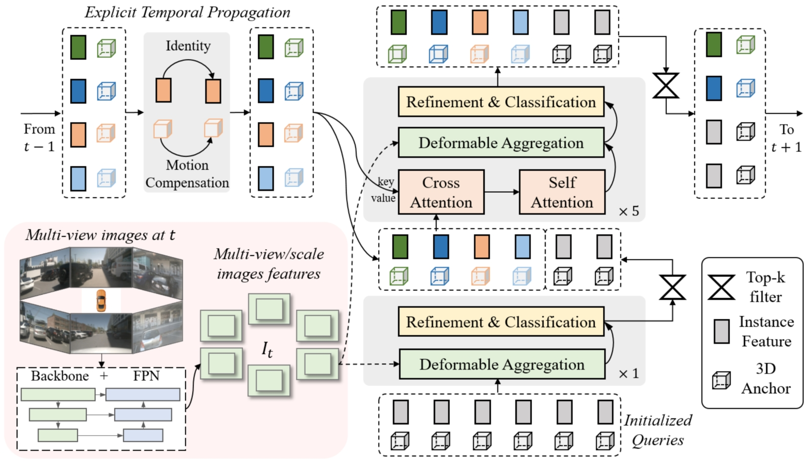

# SparseEnd2End: Obstacle 3D Detection and Tracking Architecture Based VisionTransformer

| [**Blog**](https://zhuanlan.zhihu.com/p/715179777) |  
👋 Hi, I’m ThomasVonWu. I'd like to introduce you to a  simple and practical repository that uses end-to-end model with sparse transformer to sense 3D obstacles. This repo has no complex dependency for Training | Inference | Deployment(which means, we don't need to install [MMDetection3d](https://github.com/open-mmlab/mmdetection3d), [mmcv](https://github.com/open-mmlab/mmcv), [mmcv-full](https://github.com/open-mmlab/mmcv), [mmdeploy](https://github.com/open-mmlab/mmdeploy), etc.), so it's easy to install in your local workstation or supercomputing gpu clusters. This repository will also provide x86(NVIDIA RTX  Series GPU) | ARM(NVIDIA ORIN) deployment solutions. Finally, you can deploy your e2e model onborad through this repo happily.  
👀 I guess you are interested in:  
    1. how to define PyTorch custom operation: DeformableFeatureAggregation and register related onnx custom operator?    
    2. how to make custom plugin: DeformableFeatureAggregation in TensorRT engine?  
    3. how to export onnx with custom operations to TensorRT engine?  
    4. how to validate inference results consistency: PyTorch vs. ONNX vs. TensorRT ?  
    5. how to deploy temporal fusion transformer head successfully?  

## Algorithm Architecture

    
     
    
Algorithm Framework of Sparse4D, which conforms to an encoder-decoder structure. The inputs mainly consists of three components: multi-view images, newly initialized instances, propagated instances from previous frame. The output is the refined instances (3D anchor boxes and corresponding features), serve as the perception results for the current frame. Additionally, a subset of these refined instances is selected and propagated to the next frame.

## Experimental Results
|         **Model**        | **ImgSize** | **Backbone** | **Framework** | **Precision** | **mAP** | **NDS** | **FPS** |                  **GPU**                  | **config**| **ckpt**|**onnx**|**engine**|
|:----------------------------:|:-------------------:|:------------------------:|:------------------------:|:----------------------:|:--------------:|:-------------:|:-------------:|:----------------:|:----------------:|:----------------:|:----------------:|:----------------:|
|         Sparse4Dv3      |    256x704     |     Resnet50    |           PyTorch       |            FP32        |     56.37     |     70.97    |     19.8     | NVIDIA GeForce RTX 3090 |[config](dataset/config/sparse4d_temporal_r50_1x1_bs1_256x704_mini.py)|[ckpt](https://drive.google.com/file/d/1sSMNB7T7LPKSr8nD9S_tSiu1mJrFMZ1I/view?usp=sharing)|     --     |     --     |
|         Sparse4Dv3      |    256x704     |     Resnet50    |          TensorRT     |            FP32        |      wait       |     wait      |     wait     | NVIDIA GeForce RTX 3090 |[config](dataset/config/sparse4d_temporal_r50_1x1_bs1_256x704_mini.py)|[ckpt](https://drive.google.com/file/d/1sSMNB7T7LPKSr8nD9S_tSiu1mJrFMZ1I/view?usp=sharing)|     wait     |     wait     |
|         Sparse4Dv3      |    256x704     |     Resnet50    |          TensorRT     |            FP16        |      wait       |     wait      |     wait     | NVIDIA GeForce RTX 3090 |[config](dataset/config/sparse4d_temporal_r50_1x1_bs1_256x704_mini.py)|[ckpt](https://drive.google.com/file/d/1sSMNB7T7LPKSr8nD9S_tSiu1mJrFMZ1I/view?usp=sharing)|     wait     |     wait     |
|         Sparse4Dv3      |    256x704     |     Resnet50    |          TensorRT     |    INT8+FP16    |      wait       |     wait      |     wait     | NVIDIA GeForce RTX 3090 |[config](dataset/config/sparse4d_temporal_r50_1x1_bs1_256x704_mini.py)|[ckpt](https://drive.google.com/file/d/1sSMNB7T7LPKSr8nD9S_tSiu1mJrFMZ1I/view?usp=sharing)|     wait     |     wait     |
|         Sparse4Dv3      |    256x704     |     Resnet50    |          TensorRT     |            FP32        |      wait       |     wait      |     wait     |          NVIDIA ORIN      |[config](dataset/config/sparse4d_temporal_r50_1x1_bs1_256x704_mini.py)|[ckpt](https://drive.google.com/file/d/1sSMNB7T7LPKSr8nD9S_tSiu1mJrFMZ1I/view?usp=sharing)|     wait     |     wait     |
|         Sparse4Dv3      |    256x704     |     Resnet50    |          TensorRT     |            FP16        |      wait       |     wait      |     wait     |          NVIDIA ORIN      |[config](dataset/config/sparse4d_temporal_r50_1x1_bs1_256x704_mini.py)|[ckpt](https://drive.google.com/file/d/1sSMNB7T7LPKSr8nD9S_tSiu1mJrFMZ1I/view?usp=sharing)|     wait     |     wait     |
|         Sparse4Dv3      |    256x704     |     Resnet50    |          TensorRT     |    INT8+FP16    |      wait       |     wait      |     wait     |          NVIDIA ORIN      |[config](dataset/config/sparse4d_temporal_r50_1x1_bs1_256x704_mini.py)|[ckpt](https://drive.google.com/file/d/1sSMNB7T7LPKSr8nD9S_tSiu1mJrFMZ1I/view?usp=sharing)|     wait     |     wait     |

## News
* **`25 Aug, 2024`:** I release repo: SparseEnd2End. The complete deployment solution will be released as soon as possible. Please stay tuned! 

## Tasklist
- [X] *Register custom operation : DeformableFeatureAggregation and export ONNX and TensorRT engine. **`25 Aug, 2024`***
- [X] *Verify the consistency of reasoning results : DeformableFeatureAggregation  PyToch Implementation  vs. TensorRT plugin Implementation. **`25 Aug, 2024`***  
- [ ] *Reasoning acceleration using CUDA shared memory and CUDA FP16 in DeformableFeatureAggregation plugin Implementation.*
- [X] *Export SparseTransFormer Backbone ONNX&TensorRT engine. **`8 Sep, 2024`***
- [X] *Verify the consistency of reasoning results : SparseTransFormer Backbone PyTorch Implementation vs. ONNX Runtime vs. TensorRT engine. **`8 Sep, 2024`***
- [ ] *Export SparseTransFormer Head ONNX and TensorRT engine.*
- [ ] *Verify the consistency of reasoning results : SparseTransFormer Head PyTorch Implementation vs. TensorRT engine.*
- [ ] *Reasoning acceleration using FlashAttention in replace of MultiheadAttention.*
- [ ] *Reasoning acceleration using FP16/INT8  in replace of FP32 of TensorRT engine.*
- [ ] *Image pre-processing, Instancbank Caching and model post-processing Implementation with C++.*
- [ ] *Reasoning acceleration : Image pre-processing Instancbank Caching and model post-processing Implementation with CUDA.*
- [ ] *Onboard: Full-link reasoning using CUDA, TensorRT and C++.*

# Introduction
> SparseEnd2End is a Sparse-Centric paradigm for end-to-end autonomous driving perception.  

## Quick Start
[Quick Start](QUICK-START.md)

## Citation
If you find SparseEnd2End useful in your research or applications, please consider giving me a star &#127775;  

## 🏷 ChangeLog
>**08/25/2024：** **[v1.0.0]** This repo now supports Training | Inference in NuscenesDataset. It includes: data dump in JSON, Training | Inference  log caching, TensorBoard hooking, and so on. 