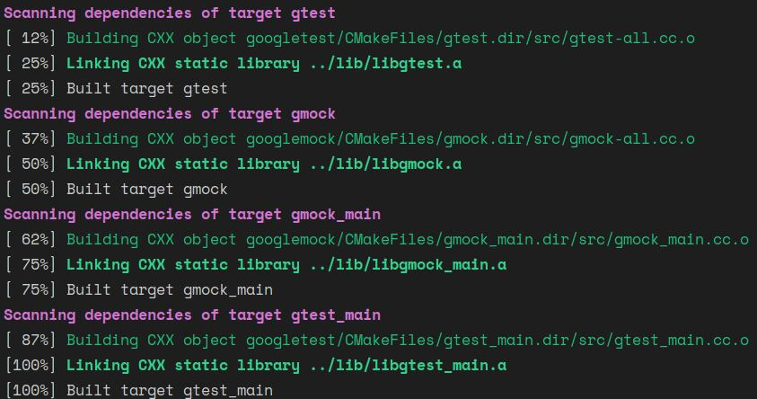
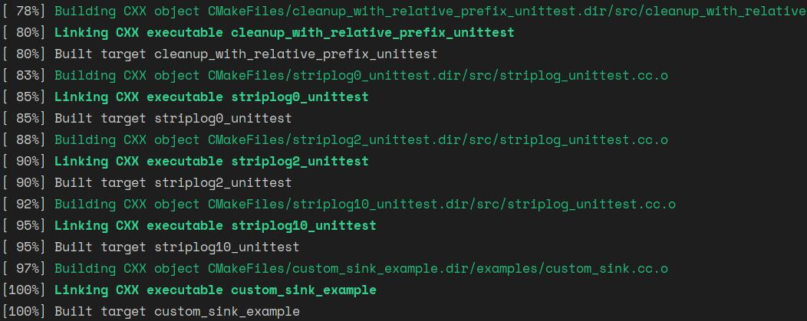
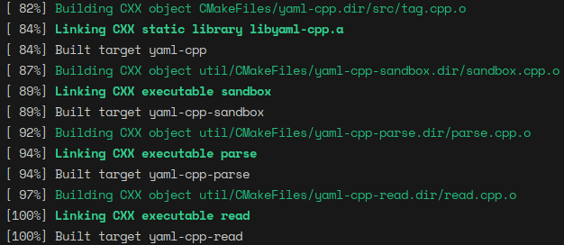

# ThirdParty Recipe

## Add Submodule:googletest
```bash
cd path/to/SparseEnd2End
git submodule add https://github.com/google/googletest.git onboard/third_party/googletest
git commit - m "add submodule googletest"
cd  onboard/third_party/googletest
cmake -B build -S .
cmake --build build
```
<center>
    
    <br>
    <div style="color:orange; border-bottom: 1px solid #d9d9d9;
    display: inline-block;
    color: #999;
    padding: 1px;">If you make successfully, you will get log like this.</div>
</center>

## Add Submodule:glog
```bash
cd path/to/SparseEnd2End
git submodule add https://github.com/google/glog.git onboard/third_party/glog
git commit - m "add submodule glog"
cd  onboard/third_party/glog
cmake -B build -S .
cmake --build build
```
<center>
    
    <br>
    <div style="color:orange; border-bottom: 1px solid #d9d9d9;
    display: inline-block;
    color: #999;
    padding: 1px;">If you make successfully, you will get log like this.</div>
</center>

## Add Submodule:yaml-cpp
```bash
cd path/to/SparseEnd2End
git submodule add https://github.com/jbeder/yaml-cpp.git onboard/third_party/yaml-cpp
git commit - m "add submodule yaml-cpp"
cd  onboard/third_party/yaml-cpp
cmake -B build -S .
cmake --build build
```
<center>
    
    <br>
    <div style="color:orange; border-bottom: 1px solid #d9d9d9;
    display: inline-block;
    color: #999;
    padding: 1px;">If you make successfully, you will get log like this.</div>
</center>